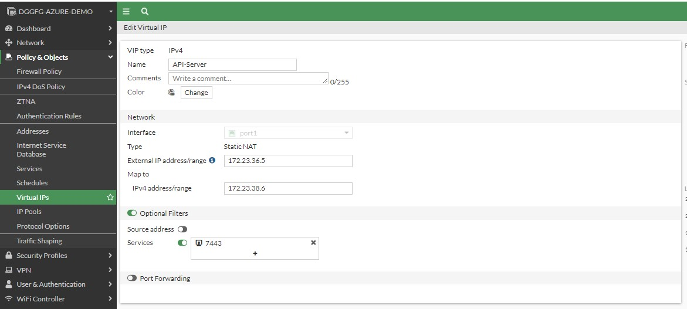

# Install Terraform (Ubuntu)

Follow the instructions at the below link to install Terraform

<https://www.terraform.io/cli/install/apt>

# Clone Repository

**git clone <https://github.com/GoochD4/FortiWeb-Cloud-Training.git>**

# Create terraform.tfvars file

When compiling, Terraform will check both the variables.tf and
terraform.tfvars files by default. Update the below text in red by
adding your key ID and Secret Access Key.

**// AWS Environment**

**access_key = "\<enter your access key ID\>"**

**secret_key = "\<enter your secret access key here\>"**

Create the file using VI :

Type:

**vi terraform.tfvars**

Type the letter **i** . This will allow you to copy and paste the above
text into the file.

Once that is done type **esc** followed by **:wq** and then hit enter.

# Run Terraform

Type:

**terraform init**

This will install all of the required provider plugins necessary to run
the modules you cloned.

**terraform apply**

Terraform will compile all of the templates and variables to create a
terraform plan which describes what you are going to create. When this
is done, you will be prompted to start the creation. Type yes

Do you want to perform these actions?

Terraform will perform the actions described above.

Only 'yes' will be accepted to approve.

Enter a value: **yes**

Terraform will now print the steps it is taking to the screen. When that
is done, you will be presented with the below outputs (these will be
different for your environment). Retain this information, as we will use
it in later steps.

FGTPublicIP = "3.141.109.99"

Password = "i-068a8a1d0869b3149"

Server_IP = "10.1.1.137"

Username = "admin"

If you lose the above information, don’t worry, it is being held in a
state file. We can always get it later using:

**terraform output**

**Test Picture**

